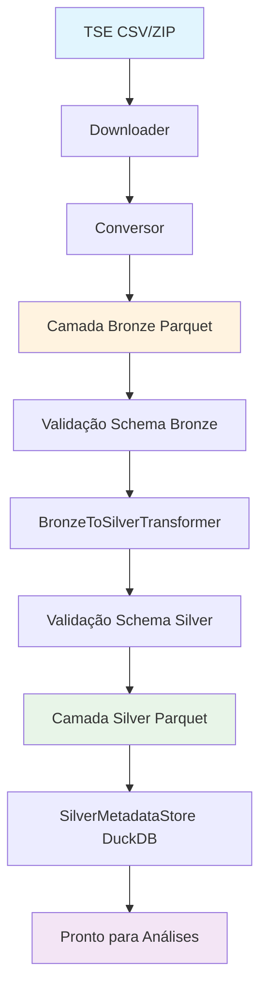

# Arquitetura do Projeto

Este projeto implementa um pipeline de dados inspirado no modelo Lakehouse,
com foco inicial na camada Bronze.

## Visão Geral

- Fonte: Dados públicos do TSE
- Processamento: Python + Polars
- Armazenamento: Parquet (Bronze e Silver)
- Metadados: DuckDB
- Execução: CLI (Typer) e Airflow

## Componentes Arquiteturais

### 1. Camada Bronze
- **Objetivo**: Landing zone analítica para dados brutos do TSE
- **Formato**: Parquet com colunas técnicas de metadados
- **Validação**: Schema explícito com falha em inconsistência
- **Organização**: Particionada por dataset e ano

### 2. Camada Silver
- **Objetivo**: Dados transformados e enriquecidos para análise
- **Formato**: Parquet otimizado para consultas analíticas
- **Enriquecimento**:
  - Taxas calculadas (comparecimento%, abstenção%)
  - Mapeamento geográfico (UF → Região)
  - Validação de qualidade (remoção de nulos)
- **Organização**: Particionada por dataset e ano
- **Metadados**: DuckDB para rastreabilidade de transformações

**Novos Componentes Implementados:**

- **SilverTransformationPipeline**: Orquestrador do fluxo Bronze → Silver
  - Coordena validação de schema, transformação e persistência
  - Aplica idempotência (DuckDB + verificação de arquivo)
  - Segue padrão consistente com IngestionPipeline (Bronze)

- **SilverMetadataStore**: Gerencia metadados de transformação
  - Usa DuckDB para rastreabilidade
  - Chave primária: (dataset, ano)
  - Campos: linhas_antes, linhas_depois, duracao_segundos, status, erro

- **RegionMapper**: Mapeamento UF → Região geográfica
  - Suporta todas as 27 UFs brasileiras
  - Retorna "Desconhecido" para UF inválida

- **SCHEMA_SILVER + Validação**: Schema físico Polars + validação contra contrato
  - Define tipos Polars para todos os campos (bronze + silver)
  - Função `validar_schema_silver_contra_contrato()` garante consistência

- **BronzeToSilverTransformer**: Lógica de transformação
  - Cálculo de taxas de comparecimento/abstenção
  - Mapeamento geográfico
  - Remoção de nulos
  - Lazy evaluation com `pl.scan_parquet()`

- **SilverTransformResult**: Result object imutável
  - @dataclass(frozen=True)
  - Contém: silver_path, linhas

### 3. Componentes de Processamento
- **Downloader**: Gerencia downloads com retry e controle de estado
- **Converter**: Transforma dados brutos para formato analítico (Parquet)
- **Transformer**: Enriquece dados Bronze → Silver (taxas, regiões)
- **Schema Validation**: Validação integrada em contratos e schemas
- **Logger**: Logging estruturado com suporte a diferentes formatos

### 4. Camada de Metadados
- **Objetivo**: Rastreabilidade e auditoria das execuções
- **Tecnologia**: DuckDB para consultas analíticas sobre metadados
- **Informações**: Timestamps, origem, checksums, status de execução

## Fluxo de Dados (Atualizado)

### Diagrama Visual



### Fluxo Textual

```
TSE (CSV/ZIP)
    ↓
Downloader (controle de estado, retry)
    ↓
Conversor (validação de schema, transformação)
    ↓
Camada Bronze (Parquet com metadados)
    ↓
Validação Schema Bronze (schema físico vs contrato lógico)
    ↓
BronzeToSilverTransformer (cálculo de taxas, mapeamento geográfico)
    ↓
Validação Schema Silver (schema físico vs contrato lógico)
    ↓
Camada Silver (Parquet enriquecido)
    ↓
SilverMetadataStore (DuckDB - rastreabilidade)
    ↓
Pronto para consultas analíticas
```

## Glossário

- **Lakehouse Pattern**: Arquitetura que combina data lake (flexibilidade) com data warehouse (estrutura), usando Parquet/DuckDB para armazenamento analítico.

- **Lazy Evaluation**: Técnica do Polars onde operações são adiadas até execução, otimizando performance e memória em grandes datasets.

- **Idempotência**: Propriedade de operações que podem ser repetidas sem efeitos colaterais, garantindo segurança em reprocessamentos.

- **Schema Físico**: Definição técnica dos tipos de dados (ex.: `pl.Float64`) usada pelo Polars para otimização.

- **Contrato Lógico**: Definição de domínio dos campos obrigatórios (ex.: `ComparecimentoContrato`), independente da implementação.

- **Medallion Architecture**: Modelo de camadas (Bronze→Silver→Gold) para evolução progressiva de dados brutos para analíticos.

- **RegionMapper**: Componente que mapeia códigos UF para regiões geográficas brasileiras (Norte, Nordeste, etc.).

- **MetadataStore**: Repositório de metadados usando DuckDB para rastrear execuções, checksums e status.

## Princípios de Consistência Bronze ↔ Silver

### Orquestração
- Bronze: `IngestionPipeline`
- Silver: `SilverTransformationPipeline`
- Ambos seguem padrão de docstring ("Esta classe:" / "Ela NÃO:")
- Ambos aplicam injeção de dependência (logger, metadata_store)

### MetadataStore
- Bronze: `MetadataStore` (metadados de ingestão)
- Silver: `SilverMetadataStore` (metadados de transformação)
- Ambos usam DuckDB com UPSERT por (dataset, ano)

### Schema Físico + Validação
- Bronze: `SCHEMA_COMPARECIMENTO` + `validar_schema_contra_contrato()`
- Silver: `SCHEMA_SILVER` + `validar_schema_silver_contra_contrato()`
- Ambos garantem consistência domínio ↔ implementação

### Lazy Evaluation
- Ambos usam `pl.scan_parquet()` ao invés de `pl.read_parquet()`
- Melhor performance em arquivos grandes

### Result Objects
- Bronze: `DownloadResult`, `ConvertResult`
- Silver: `SilverTransformResult`
- Todos são `@dataclass(frozen=True)`

## Características do Pipeline

### Idempotência
- Execuções repetidas não produzem dados duplicados
- Baseado em chave lógica (dataset + ano)
- Permite reprocessamento seguro

### Observabilidade
- Logging estruturado com contextos
- Métricas de performance
- Rastreabilidade completa

### Confiabilidade
- Tratamento explícito de erros
- Retry com estratégias configuráveis
- Validação rigorosa de dados

## Orquestração

O pipeline pode ser executado:
- Via CLI para execuções ad-hoc
- Via Airflow para execuções agendadas
- Em ambiente local ou cloud

## Escalabilidade

- Processamento paralelo com Polars
- Formato Parquet otimizado para leitura analítica
- Estrutura de particionamento eficiente