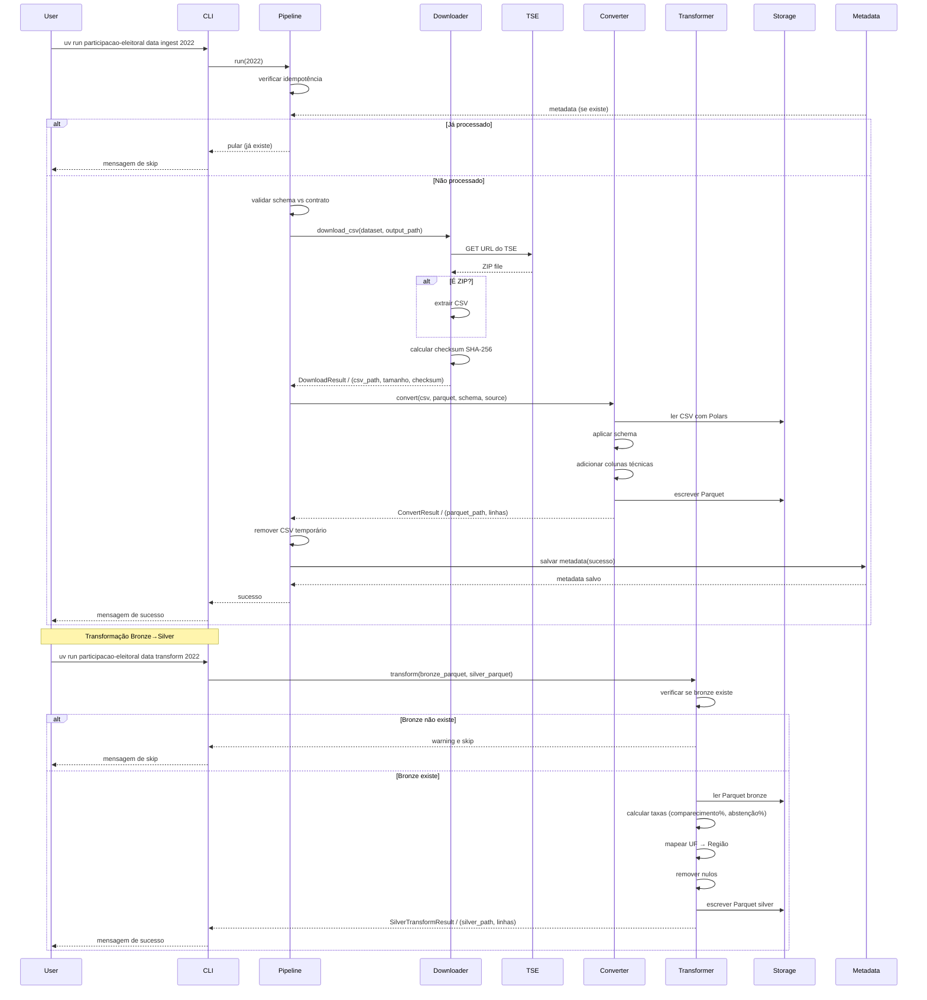
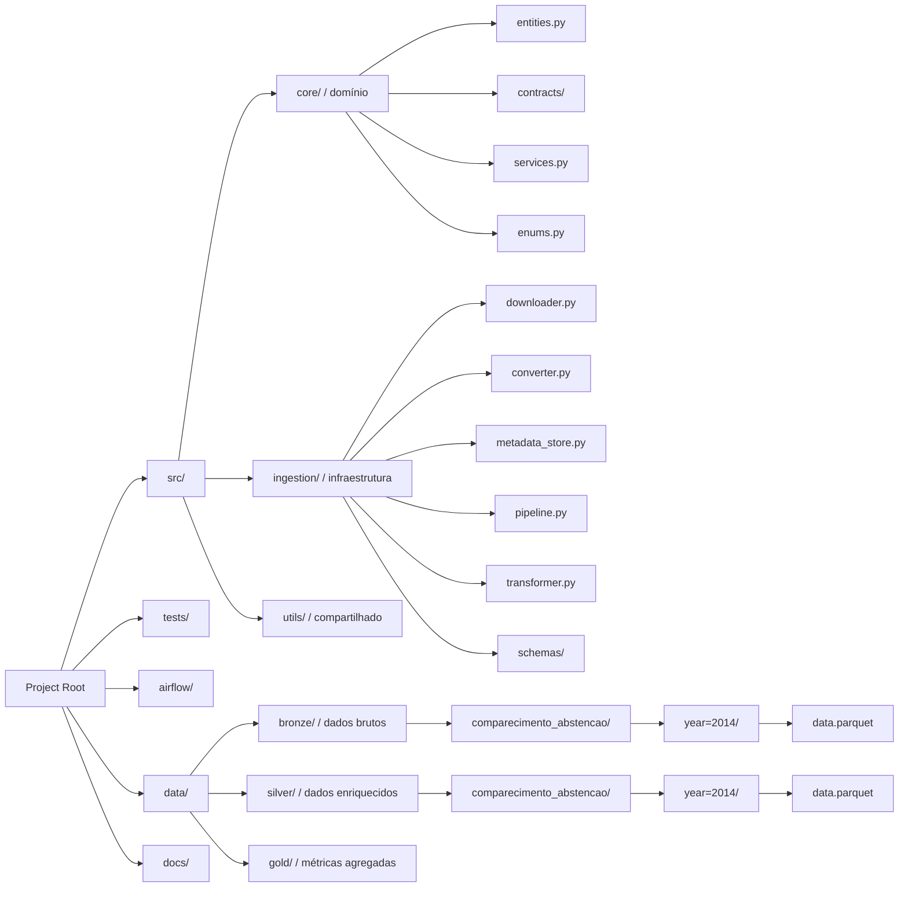

# Diagramas de Arquitetura

## Diagrama de Arquitetura

```mermaid
    graph TB
        subgraph "Fonte de Dados"
            TSE["TSE API / Dados Públicos / Eleitorais"]

        subgraph "Camada de Ingestão"
            CLI["CLI / Comandos Ad-hoc"]
            AF["Airflow / Orquestração"]
            DL["Downloader / HTTP/ZIP"]
            CV["Converter / CSV→Parquet"]
            TR["Transformer / Bronze→Silver"]

        subgraph "Lakehouse"
            BRZ["Bronze Layer / Parquet Files / Dados Brutos"]
            SLV["Silver Layer / Parquet Enriquecido / Taxas e Regiões"]
            GLD["Gold Layer / Planejado"]

        subgraph "Metadados"
            META["Metadata Store / DuckDB / Rastreabilidade"]

        TSE --> CLI
        TSE --> AF
        CLI --> DL
        AF --> DL
        DL --> CV
        CV --> BRZ
        TR --> SLV
        BRZ --> SLV
        SLV --> META
        SLV --> GLD

        subgraph "Core (Domínio)"
            ENT["Entidades / Dataset"]
            CNT["Contratos / Validação"]
            SRV["Services / Regras de Negócio"]

        BRZ --> ENT
        BRZ --> CNT
        SLV --> SRV

    end
```

## Diagrama de Fluxo de Dados



## Diagrama de Estrutura de Diretórios



## Diagrama de Camadas de Dados

    ```mermaid
    graph TB
        subgraph "Fonte de Dados"
            TSE["TSE API / Dados Públicos / Eleitorais"]
        end

        subgraph "Camada de Ingestão"
            CLI["CLI / Comandos Ad-hoc"]
            AF["Airflow / Orquestração"]
            DL["Downloader / HTTP / ZIP"]
            CV["Converter / CSV para Parquet"]
            TR["Transformer / Bronze para Silver"]
        end

        subgraph "Lakehouse"
            BRZ["Bronze Layer / Parquet Files / Dados Brutos"]
            SLV["Silver Layer / Parquet Enriquecido / Taxas e Regiões"]
            GLD["Gold Layer / Planejado"]
        end

        subgraph "Metadados"
            META["Metadata Store / DuckDB / Rastreabilidade"]
        end
    ```
