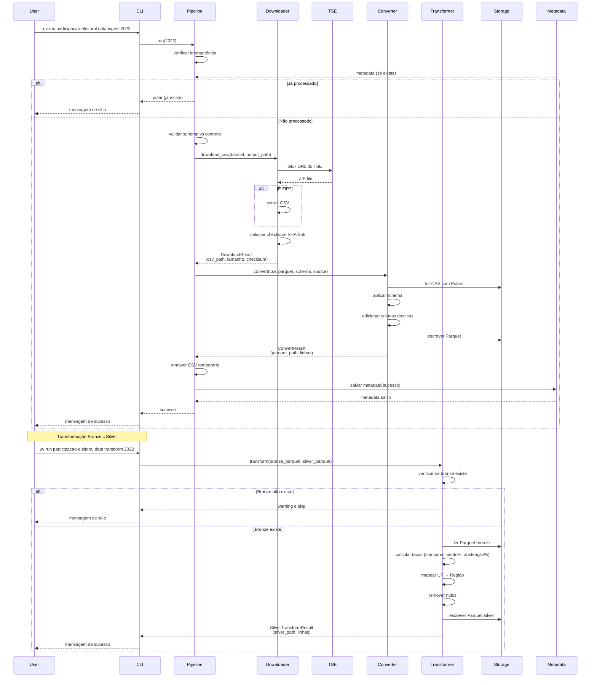
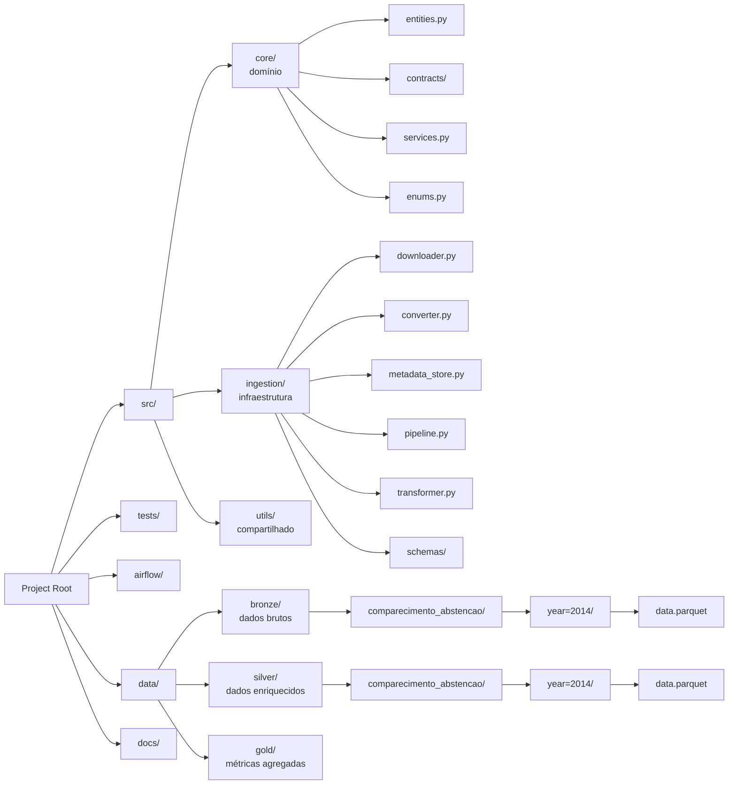
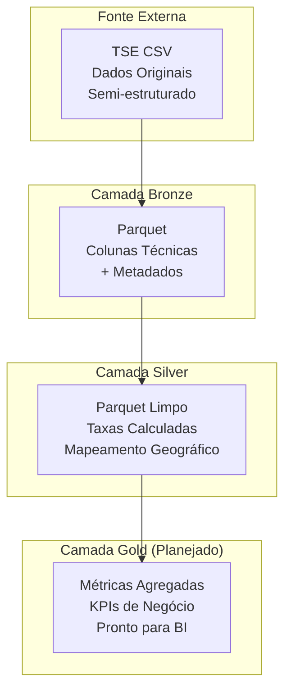

# Diagramas de Arquitetura

## Diagrama de Arquitetura

```mermaid
graph TB
    subgraph "Fonte de Dados"
        TSE[TSE API<br/>Dados Públicos<br/>Eleitorais]
    end

    subgraph "Camada de Ingestão"
        CLI[CLI<br/>Comandos Ad-hoc]
        AF[Airflow<br/>Orquestração]
        DL[Downloader<br/>HTTP/ZIP]
        CV[Converter<br/>CSV→Parquet]
        TR[Transformer<br/>Bronze→Silver]
    end

    subgraph "Lakehouse"
        BRZ[Bronze Layer<br/>Parquet Files<br/>(Dados Brutos)]
        SLV[Silver Layer<br/>Parquet Enriquecido<br/>(Taxas e Regiões)]
        GLD[Gold Layer<br/>(Planejado)]
    end

    subgraph "Metadados"
        META[Metadata Store<br/>DuckDB<br/>Rastreabilidade]
    end

    subgraph "Core (Domínio)"
        ENT[Entidades<br/>Dataset]
        CNT[Contratos<br/>Validação]
        SRV[Services<br/>Regras de Negócio]
    end

    TSE --> DL
    CLI --> AF
    AF --> DL
    DL --> CV
    CV --> BRZ
    CV --> META
    BRZ --> TR
    TR --> SLV

    ENT --> CNT
    SRV --> META
```

## Diagrama de Fluxo de Dados



## Diagrama de Estrutura de Diretórios



## Diagrama de Camadas de Dados


